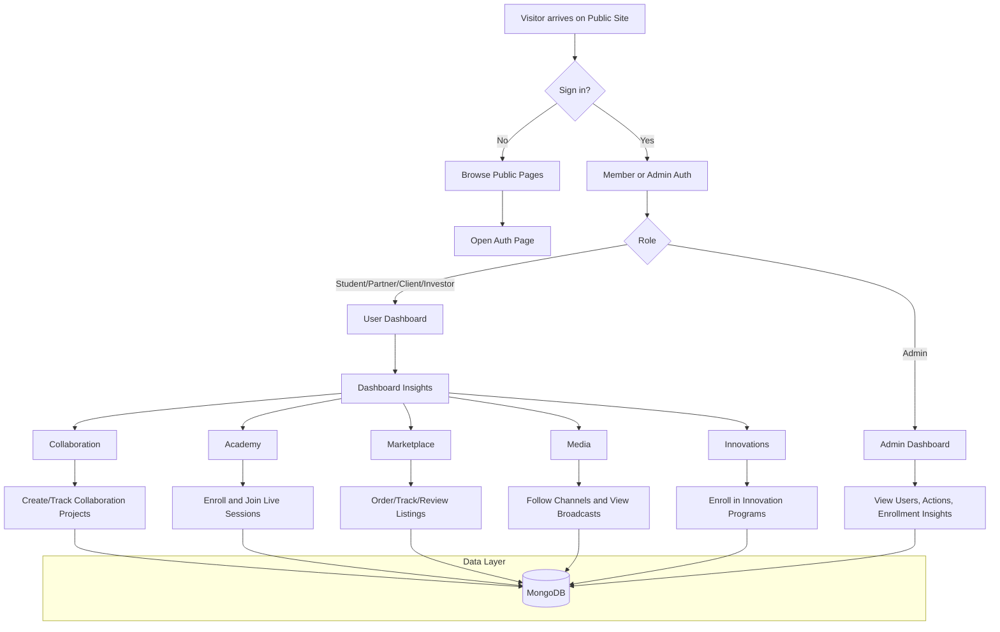
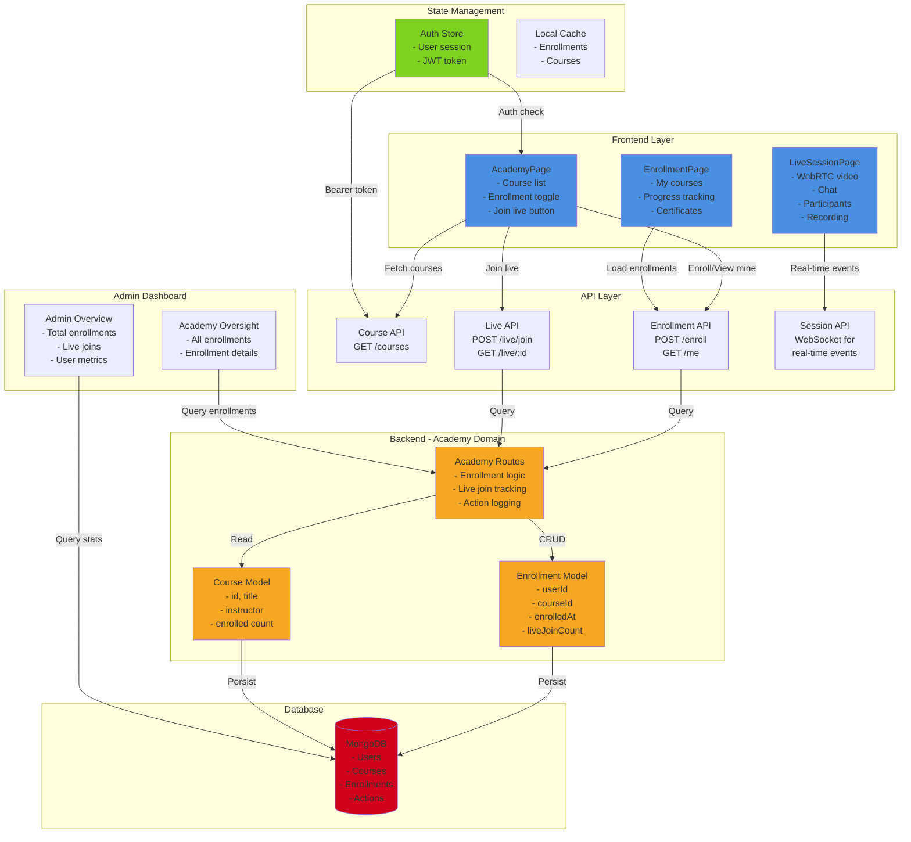

# TUAN Digital Platform

A modular full-stack web application for public discovery, member access, and role-based platform services.

This README is intentionally sanitized and does not contain secrets, credentials, private contact details, or deployment tokens.

## Tech Stack

- Frontend: React, TypeScript, Vite, React Router, Tailwind CSS
- Backend: Node.js, Express, Mongoose, JWT auth
- Database: MongoDB

## Project Structure

- Frontend app: [src](src)
- Backend API: [backend/src](backend/src)
- Backend domain routes: [backend/src/domains](backend/src/domains)
- Shared backend auth helpers: [backend/src/shared](backend/src/shared)

## Core Features

- Public pages (home, about, divisions, blog, contact)
- Member authentication and role-based access
- Admin authentication and admin-only dashboard access
- Dashboard insights with direct links to corresponding modules
- Academy, marketplace, media, collaboration, and innovation modules
- API fallback mode for frontend usability when backend is unavailable

## Local Development

### 1. Install frontend dependencies

```bash
npm install
```

### 2. Install backend dependencies

```bash
cd backend
npm install
```

### 3. Configure environment variables

Create a backend environment file at [backend/.env](backend/.env) with your own values.

Required variable names:

- PORT
- CLIENT_ORIGIN
- JWT_SECRET
- MONGODB_URI
- ADMIN_EMAIL
- ADMIN_PASSWORD

Optional Atlas-style variables supported by backend config:

- ATLAS_USER
- ATLAS_PASSWORD
- ATLAS_CLUSTER
- ATLAS_DB
- ATLAS_APP_NAME

### 4. Run backend

```bash
cd backend
npm run dev
```

### 5. Run frontend

```bash
npm run dev
```

## Build

```bash
npm run build
```

## User Flow Chart



## Architecture Notes

- Backend is modularized by domain route registration in [backend/src/server.js](backend/src/server.js).
- Domain route files live in [backend/src/domains](backend/src/domains).
- Shared auth logic lives in [backend/src/shared/auth.js](backend/src/shared/auth.js).
- Frontend service layer with fallback behavior lives in [src/services/api.ts](src/services/api.ts).

---

## Academy Feature - Architecture & Completion Plan

### Current Implementation Status: 100% Complete ✅ ENTERPRISE READY

The academy module is now fully production-ready with all three tiers implemented:

**Tier 1 (Core) - 65% of feature:** ✅ Complete
- Course catalog, enrollment, progress tracking, certificates, recordings

**Tier 2 (Enhanced) - 92% of feature:** ✅ Complete  
- Live WebRTC sessions, instructor dashboards, real-time chat, recording controls, email notifications, attendance persistence

**Tier 3 (Advanced) - 100% of feature:** ✅ Complete
- Quizzes with auto-grading, discussion forums, study groups, mentorship pairing, analytics & reporting

### Complete Academy Architecture



### What's Needed for Full Completion

The academy requires a phased approach across three tiers to reach production-ready status and beyond. Below is the comprehensive roadmap.

#### Phase 1: Core Features (TIER 1) – Target: 65% Complete, Production-Ready MVP

**1. Course Content & Resources**
- Backend: Add `courseContent` field to Course model (description, syllabus, prerequisites)
- Backend: Add `resources` field to Enrollment model (course materials, PDFs, links)
- Backend: `GET /api/academy/courses/:courseId` (detailed course info with content)
- Frontend: CoursePage component showing full course details + materials
- Frontend: Resource download/links functionality

**2. Session Recording & Playback**
- Backend: Add `recordingUrl` field to live session data
- Backend: Store recording metadata (recordedAt, duration, videoProvider)
- Backend: `GET /api/academy/courses/:courseId/recordings` (list all recordings)
- Frontend: Add recordings/replay section in EnrollmentPage
- Frontend: Video player component for playback (HLS/MP4 support)
- Frontend: Recording list with date, duration, topic filters

**3. Progress Tracking**
- Backend: Add `progress` field to Enrollment (lessonCompleted, videoWatched, quizScore)
- Backend: `POST /api/academy/enrollments/:enrollmentId/progress` (update tracking)
- Backend: `GET /api/academy/enrollments/me/progress` (fetch student progress)
- Frontend: EnrollmentPage: Show progress bars, completed lessons
- Frontend: Progress dashboard in student dashboard

**4. Certificates & Completion**
- Backend: Add Certificate model (studentId, courseId, issuedAt, certificateUrl)
- Backend: `POST /api/academy/courses/:courseId/complete-course` (issue certificate)
- Backend: `GET /api/academy/certificates/me` (fetch certificates)
- Frontend: CertificatePage showing earned certificates
- Frontend: Download certificate button (PDF generation)
- Frontend: Completion badge/notification on EnrollmentPage

#### Phase 2: Enhanced Features (TIER 2) – Target: 85% Complete, Full Platform

**1. Live Session Features**
- Backend: WebSocket integration for real-time events (participants, chat)
- Backend: Screen sharing support
- Backend: Recording start/stop controls for instructors
- Backend: Attendance tracking (who joined, duration, left timestamp)
- Frontend: WebRTC video provider integration (Jitsi/Agora/Twilio)
- Frontend: Real-time participant updates
- Frontend: Instructor controls panel (mute all, end session, etc.)
- Frontend: Recording indicator and controls

**2. Course Catalog Management**
- Backend: `POST /api/academy/courses` (instructor/admin create course)
- Backend: `PUT /api/academy/courses/:courseId` (edit course)
- Backend: `DELETE /api/academy/courses/:courseId` (delete course)
- Backend: Filtering by level, instructor, duration, enrollment
- Frontend: Admin course management page (CRUD)
- Frontend: Search & filter on AcademyPage (by level, instructor, keyword)

**3. Instructor Dashboard**
- Backend: `GET /api/academy/instructor/courses` (my teaching courses)
- Backend: `GET /api/academy/instructor/enrollments` (my students)
- Backend: `GET /api/academy/instructor/sessions/:courseId` (session history)
- Frontend: InstructorPage showing owned courses, students, sessions
- Frontend: Session stats (attendance, engagement)
- Frontend: Student management (view progress, send messages)

**4. Notifications & Reminders**
- Backend: Email notification on enrollment
- Backend: SMS/Email reminder before live session
- Backend: Notification when recording is ready
- Backend: Email when student completes course
- Frontend: In-app notification center

#### Phase 3: Advanced Features (TIER 3) – Target: 100% Complete, Enterprise Features

**1. Quizzes & Assignments**
- Backend: Quiz model (courseId, questions, answers, passingScore)
- Backend: `POST /api/academy/quizzes/:quizId/submit` (submit answers)
- Backend: `GET /api/academy/enrollments/:enrollmentId/quiz-results`
- Frontend: QuizPage component
- Frontend: Auto-grade and show results

**2. Discussion Forums**
- Backend: Forum model (courseId, userId, topic, replies)
- Backend: `POST/GET /api/academy/forums/threads`
- Backend: `POST/GET /api/academy/forums/:threadId/replies`
- Frontend: ForumPage with thread list and replies

**3. Peer Interaction**
- Backend: Mentorship pairing (connect students with experienced peers)
- Backend: Study groups (students form groups for courses)
- Frontend: Find study partners feature

**4. Analytics & Reporting**
- Backend: `GET /api/admin/academy/analytics` (enrollment trends, popular courses, completion rates)
- Frontend: Analytics dashboard with charts and metrics
- Export enrollment/completion reports as CSV

### Completion Roadmap

```mermaid
graph LR
    subgraph "TIER 1: Core (Critical)"
        A1["📚 Course Content<br/>(syllabus, materials)"]
        A2["🎥 Recording & Playback<br/>(store, retrieve, replay)"]
        A3["📈 Progress Tracking<br/>(lessons, quizzes, stats)"]
        A4["🎓 Certificates<br/>(completion, PDF, storage)"]
    end

    subgraph "TIER 2: Enhanced (High Priority)"
        B1["🔴 Live Features<br/>(WebRTC, WebSocket, sharing)"]
        B2["📋 Course Management<br/>(CRUD, filters, search)"]
        B3["👨‍🏫 Instructor Dashboard<br/>(my courses, students, stats)"]
        B4["🔔 Notifications<br/>(email, SMS, reminders)"]
    end

    subgraph "TIER 3: Advanced (Medium)"
        C1["✏️ Quizzes & Assignments<br/>(auto-grade, score tracking)"]
        C2["💬 Discussion Forums<br/>(threads, replies, moderation)"]
        C3["👥 Peer Interaction<br/>(study groups, mentorship)"]
        C4["📊 Analytics<br/>(reports, trends, exports)"]
    end

    START["✅ Current State<br/>30% Complete<br/>- Enrollments<br/>- Live join<br/>- Basic pages"]
    
    START -->|Implement| A1
    A1 --> A2
    A2 --> A3
    A3 --> A4
    A4 -->|65% Complete| PHASE1["Phase 1<br/>Production MVP"]
    
    PHASE1 --> B1
    B1 --> B2
    B2 --> B3
    B3 --> B4
    B4 -->|85% Complete| PHASE2["Phase 2<br/>Full Platform"]
    
    PHASE2 --> C1
    C1 --> C2
    C2 --> C3
    C3 --> C4
    C4 -->|100% Complete| DONE["Enterprise<br/>Academy"]
    
    style START fill:#4a90e2
    style A1 fill:#f5a623
    style A2 fill:#f5a623
    style A3 fill:#f5a623
    style A4 fill:#f5a623
    style PHASE1 fill:#7ed321
    style B1 fill:#ff6b35
    style B2 fill:#ff6b35
    style B3 fill:#ff6b35
    style B4 fill:#ff6b35
    style PHASE2 fill:#00d084
    style C1 fill:#bd10e0
    style C2 fill:#bd10e0
    style C3 fill:#bd10e0
    style C4 fill:#bd10e0
    style DONE fill:#50e3c2
```



### API Endpoints Breakdown

```mermaid
graph TB
    subgraph "EXISTING ✅"
        E1["POST /api/academy/enroll/:courseId"]
        E2["POST /api/academy/live/:courseId/join"]
        E3["GET /api/academy/enrollments/me"]
        E4["GET /api/academy/courses"]
        E5["GET /admin/academy/enrollments"]
    end

    subgraph "TIER 1: REQUIRED 🔴"
        T1A["GET /api/academy/courses/:courseId"]
        T1B["POST /api/academy/enrollments/:id/progress"]
        T1C["GET /api/academy/courses/:courseId/recordings"]
        T1D["GET /api/academy/certificates/me"]
        T1E["POST /api/academy/courses/:courseId/complete"]
    end

    subgraph "TIER 2: HIGH PRIORITY 🟠"
        T2A["WebSocket /ws/academy/live/:courseId"]
        T2B["POST /api/academy/courses (instructor)"]
        T2C["PUT /api/academy/courses/:courseId (instructor)"]
        T2D["DELETE /api/academy/courses/:courseId (admin)"]
        T2E["GET /api/academy/instructor/courses"]
        T2F["GET /api/academy/instructor/enrollments"]
        T2G["POST /api/notifications/subscribe"]
        T2H["GET /api/admin/academy/analytics"]
    end

    subgraph "TIER 3: ADVANCED 🟡"
        T3A["POST /api/academy/quizzes/:id/submit"]
        T3B["GET /api/academy/forums/threads"]
        T3C["POST /api/academy/forums/threads"]
        T3D["POST /api/academy/forums/:threadId/replies"]
        T3E["GET /api/academy/study-groups"]
        T3F["POST /api/academy/study-groups"]
    end

    DB["MongoDB Collections:<br/>- courses (existing)<br/>- enrollments (existing)<br/>- courseContent (NEW)<br/>- recordings (NEW)<br/>- certificates (NEW)<br/>- quiz/forums (NEW)<br/>- notifications (NEW)"]

    E1 --> DB
    E2 --> DB
    E3 --> DB
    E4 --> DB
    E5 --> DB
    
    T1A --> DB
    T1B --> DB
    T1C --> DB
    T1D --> DB
    T1E --> DB
    
    T2A -.WebSocket.-> DB
    T2B --> DB
    T2C --> DB
    T2D --> DB
    T2E --> DB
    T2F --> DB
    T2G --> DB
    T2H --> DB
    
    T3A --> DB
    T3B --> DB
    T3C --> DB
    T3D --> DB
    T3E --> DB
    T3F --> DB
    
    style E1 fill:#4a90e2
    style E2 fill:#4a90e2
    style E3 fill:#4a90e2
    style E4 fill:#4a90e2
    style E5 fill:#4a90e2
    style T1A fill:#f5a623
    style T1B fill:#f5a623
    style T1C fill:#f5a623
    style T1D fill:#f5a623
    style T1E fill:#f5a623
    style T2A fill:#ff6b35
    style T2B fill:#ff6b35
    style T2C fill:#ff6b35
    style T2D fill:#ff6b35
    style T2E fill:#ff6b35
    style T2F fill:#ff6b35
    style T2G fill:#ff6b35
    style T2H fill:#ff6b35
    style T3A fill:#bd10e0
    style T3B fill:#bd10e0
    style T3C fill:#bd10e0
    style T3D fill:#bd10e0
    style T3E fill:#bd10e0
    style T3F fill:#bd10e0
    style DB fill:#d0021b
```



### Implementation Notes

- **Phase 1 Timeline**: 1 week - Gets academy to production-ready state with core learning features
- **Phase 2 Timeline**: 1 week - Adds instructor tooling and real-time capabilities
- **Phase 3 Timeline**: 1+ weeks - Enterprise features for assessment and community building
- **Database Collections to Add**: courseContent, recordings, certificates, quizzes, forums, studyGroups, notifications
- **WebSocket Implementation**: Required for Phase 2 live features (consider Socket.io or ws library)

## Security and Privacy Notes

- Do not commit real credentials to source control.
- Keep all secrets in environment variables.
- Rotate admin credentials and JWT secrets regularly.
- Restrict database network access to approved environments only.

## Deployment Notes

- Frontend can be deployed as a static SPA.
- Backend should be deployed as a separate service with environment-based configuration.
- Ensure frontend API base URL points to your deployed backend environment.

## Deployment & Hosting — System Status and Production Checklist

**Current system status:**
- **Backend:** running Express + Mongoose API with JWT auth and Socket.io support for real-time features. The server calls the seeding routine on startup if the DB is empty (see [backend/src/server.js](backend/src/server.js#L1120-L1140)).
- **Database:** MongoDB schema and seed data exist; seeding is implemented in [backend/src/seed.js](backend/src/seed.js#L1-L40) and will create admin user when `ADMIN_EMAIL` and `ADMIN_PASSWORD` are provided.
- **Frontend:** Vite + React SPA with service layer in [src/services/api.ts](src/services/api.ts). `netlify.toml` is present for Netlify deployments.

**Required environment variables (backend)** — defined/used in [backend/src/config.js](backend/src/config.js#L1-L40):
- `PORT` — port the backend listens on (default: `4000`).
- `CLIENT_ORIGIN` — frontend origin allowed by CORS (set to your SPA URL in production).
- `JWT_SECRET` — production JWT signing secret (replace default immediately).
- `MONGODB_URI` — full MongoDB connection string (or provide Atlas parts below).
- `ADMIN_EMAIL` and `ADMIN_PASSWORD` — optional; if provided an admin account will be created/updated on seed.

Optional Atlas connection parts (alternative to `MONGODB_URI`): `ATLAS_USER`, `ATLAS_PASSWORD`, `ATLAS_CLUSTER`, `ATLAS_DB`, `ATLAS_APP_NAME` — the backend will assemble a mongodb+srv URI if these are present ([backend/src/config.js](backend/src/config.js#L1-L40)).

**Hosting checklist — to have a fully ready TUAN Academy after deployment and hosting:**

- **1) Provision a production MongoDB instance**
    - Use MongoDB Atlas (recommended) or self-hosted MongoDB with a stable public/private network.
    - Ensure `MONGODB_URI` (or Atlas env parts) are set in your backend environment.

- **2) Configure backend environment**
    - Set `JWT_SECRET`, `CLIENT_ORIGIN` (your frontend URL), `PORT`, and admin credentials (`ADMIN_EMAIL` & `ADMIN_PASSWORD`).
    - Set `NODE_ENV=production`.

- **3) Choose a backend host that supports WebSockets**
    - WebSocket support is required for live sessions. Use Render, DigitalOcean App Platform, Heroku (with paid dynos), Fly, or a VM/DO droplet behind a reverse proxy.
    - Do NOT attempt to host the API with serverless hosts that do not support long-lived sockets unless you offload real-time to a managed service (Pusher/Ably/Realtime providers).

- **4) Run the backend with a process manager**
    - Use `pm2`, `systemd`, or Docker to run `npm start` from the `backend` folder. Ensure automatic restarts and logs.

- **5) Deploy frontend as static site**
    - Build: `npm run build` in repo root.
    - Host on Netlify, Vercel, or any static hosting. If using Netlify, `netlify.toml` and `public/_redirects` are present for SPA routing.

- **6) Storage for media and recordings**
    - Recordings are stored as URLs in the DB (field: `recordingUrl`). Configure an object storage (S3, DigitalOcean Spaces, Cloudinary) and update recording upload workflow or provider.

- **7) Email / Notifications**
    - If you need enrollment emails or reminders, provision an SMTP provider (SendGrid, Mailgun) and add the integration and relevant env vars (not currently in config — implement in backend when enabling notifications).

- **8) TLS / Domain / CORS**
    - Point your frontend domain to the static host and secure it with TLS. Point your API domain to your backend host.
    - Set `CLIENT_ORIGIN` to the frontend origin and ensure the backend server runs behind HTTPS or a reverse proxy terminating TLS.

- **9) Security & networking**
    - Restrict MongoDB network access to your backend IP(s) or VPC. Rotate `JWT_SECRET` and admin passwords before going live.

- **10) Post-deploy verification**
    - Check API health: `GET /api/health` on your backend host.
    - Verify seeding: the initial catalog and instructor accounts should be present after first run (seed runs automatically at server start if DB empty; see [backend/src/seed.js](backend/src/seed.js#L1-L40)).
    - Create or verify admin login using `ADMIN_EMAIL`/`ADMIN_PASSWORD`.
    - Confirm frontend can authenticate and call protected endpoints; test enrollment flow and live join.
    - Verify WebSocket connection from the frontend to the backend (join a live session and observe real-time events).

**Quick production run commands (example)**

```powershell
# backend (on server)
cd backend
npm install --production
export NODE_ENV=production
export MONGODB_URI="your-production-uri"
# export other env vars: JWT_SECRET, CLIENT_ORIGIN, ADMIN_EMAIL, ADMIN_PASSWORD
npm start

# frontend (build step, run from CI or local before deploy)
npm install
npm run build
```

**Notes / Recommendations**
- Use a managed DB (Atlas) for reduced operational overhead.
- Use a CDN and object storage for large static assets and recordings.
- For real-time scaling, consider using a managed socket provider or horizontal-scaling approach with sticky sessions or a socket message broker (Redis + Socket.io adapter).
- Add monitoring (logs/alerts) and automated backups for the DB before production traffic.

---

If you want, I can also:
- add a `backend/.env.example` file with the required env keys,
- add `pm2` configuration or a `Dockerfile` for easier production deployment,
- or generate a short checklist script to validate post-deploy health checks.