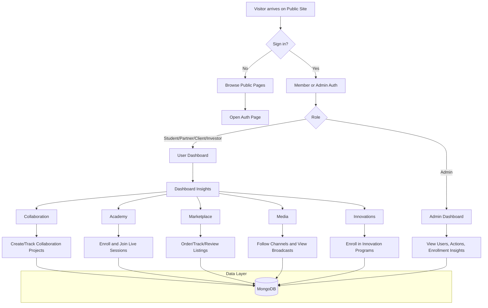

# TUAN Digital Platform

A modular full-stack web application for public discovery, member access, and role-based platform services.

This README is intentionally sanitized and does not contain secrets, credentials, private contact details, or deployment tokens.

## Tech Stack

- Frontend: React, TypeScript, Vite, React Router, Tailwind CSS
- Backend: Node.js, Express, Mongoose, JWT auth
- Database: MongoDB

## Project Structure

- Frontend app: [src](src)
- Backend API: [backend/src](backend/src)
- Backend domain routes: [backend/src/domains](backend/src/domains)
- Shared backend auth helpers: [backend/src/shared](backend/src/shared)

## Core Features

- Public pages (home, about, divisions, blog, contact)
- Member authentication and role-based access
- Admin authentication and admin-only dashboard access
- Dashboard insights with direct links to corresponding modules
- Academy, marketplace, media, collaboration, and innovation modules
- API fallback mode for frontend usability when backend is unavailable

## Local Development

### 1. Install frontend dependencies

```bash
npm install
```

### 2. Install backend dependencies

```bash
cd backend
npm install
```

### 3. Configure environment variables

Create a backend environment file at [backend/.env](backend/.env) with your own values.

Required variable names:

- PORT
- CLIENT_ORIGIN
- JWT_SECRET
- MONGODB_URI
- ADMIN_EMAIL
- ADMIN_PASSWORD

Optional Atlas-style variables supported by backend config:

- ATLAS_USER
- ATLAS_PASSWORD
- ATLAS_CLUSTER
- ATLAS_DB
- ATLAS_APP_NAME

### 4. Run backend

```bash
cd backend
npm run dev
```

### 5. Run frontend

```bash
npm run dev
```

## Build

```bash
npm run build
```

## User Flow Chart



## Architecture Notes

- Backend is modularized by domain route registration in [backend/src/server.js](backend/src/server.js).
- Domain route files live in [backend/src/domains](backend/src/domains).
- Shared auth logic lives in [backend/src/shared/auth.js](backend/src/shared/auth.js).
- Frontend service layer with fallback behavior lives in [src/services/api.ts](src/services/api.ts).

## Security and Privacy Notes

- Do not commit real credentials to source control.
- Keep all secrets in environment variables.
- Rotate admin credentials and JWT secrets regularly.
- Restrict database network access to approved environments only.

## Deployment Notes

- Frontend can be deployed as a static SPA.
- Backend should be deployed as a separate service with environment-based configuration.
- Ensure frontend API base URL points to your deployed backend environment.